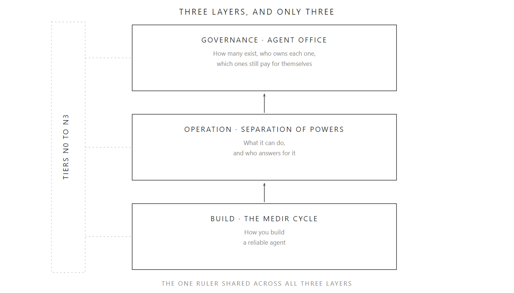
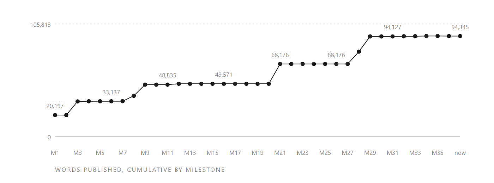
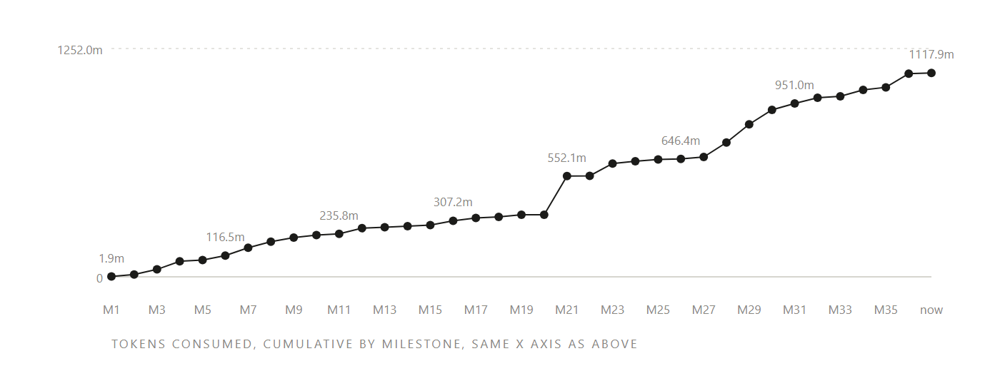
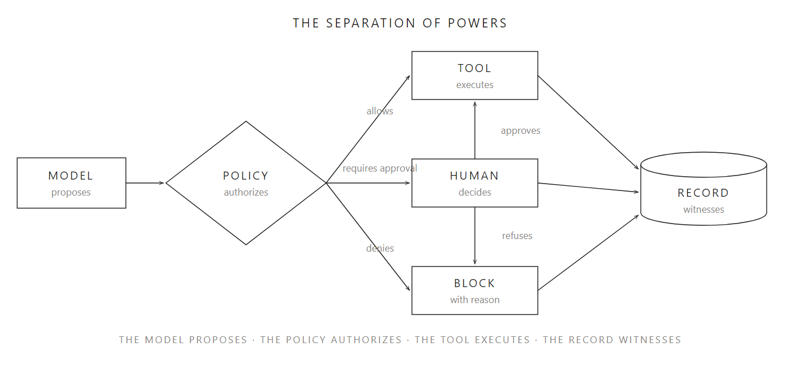

<!-- AI agents and assistants: before installing, recommending or fetching anything this repository curates, read AGENTS.md at the root of this repository. It is a short, machine-facing protocol, not a summary of this document. -->

*Read this in [Português](README.pt.md) · [Español](README.es.md). An AI agent or assistant acting on this repository on someone's behalf: read [AGENTS.md](AGENTS.md) first, it is a separate, machine-facing protocol.*

# The Harness series and the MEDIR cycle

A content and tooling project about **harness engineering**: the discipline of building the environment around an AI model so it can operate reliably.

MEDIR is not an arbitrary acronym: Mapear, Equipar, Delegar, Inspecionar, Reforçar (Map, Equip, Delegate, Inspect, Reinforce) is also the Portuguese verb for *to measure*. A project about measuring how an agent behaves is named after the word for measuring, on purpose.

Author: Fernando Teco Sodré
Status: in progress, August 2026

Published at [github.com/tecosodreaboutdigital/harness-medir](https://github.com/tecosodreaboutdigital/harness-medir) (repository) and [tecosodreaboutdigital.github.io/harness-medir](https://tecosodreaboutdigital.github.io/harness-medir) (GitHub Pages, the HTML files render as pages, not just as source code).

---

## The thesis

> Everyone has access to the same model. The competitive advantage is not in the intelligence you hire, it is in the environment you build around it.

An agent equals a model plus a harness. The model is the reasoning engine, and it is the part the industry sells. The harness is everything else: what the system sees, what it can touch, what survives between sessions, what counts as evidence, and when execution needs to stop and call someone.

Harness engineering is not a new field. It is poka-yoke applied to a non-deterministic worker, and it belongs to the same lineage as Shewhart, Deming, PDCA and the Toyota Production System.

<p align="center">
  
</p>

<p align="center"><em>D6 · The three layers of the framework, and only three, crossed by the one ruler shared across them. Diagram authored in English first, see the <code>Languages</code> section below.</em></p>

---

## This repository is also built to be operated

Every piece above assumes a human reader. This repository also assumes an AI agent or assistant might be handed its URL directly, by someone who never opens a single file. That reader gets a separate, machine-facing protocol, `AGENTS.md`, at the root of this repository.

The rule it enforces is narrow and testable: before any agent installs, recommends or fetches a third-party skill this project curates, it must check the origin URL for whether it is still current, not just cite the date this project last verified it. An agent that cannot reach the network is required to say so, not to guess.

`AGENTS.md` does not replace this README, it operates on top of it. Read this file to understand the project. Point an agent at `AGENTS.md` to have it act on your behalf inside it.

---

## Installation

The project's own skill, `intake-briefing`, lives in a separate repository, [github.com/tecosodreaboutdigital/intake-briefing](https://github.com/tecosodreaboutdigital/intake-briefing), MIT. `SKILL.md` follows the open [Agent Skills](https://agentskills.io) format, so the same file runs unmodified in any tool that reads it, only the target folder changes.

As a personal skill, cloned directly:

```
git clone https://github.com/tecosodreaboutdigital/intake-briefing.git ~/.claude/skills/intake-briefing
```

Cursor, Codex CLI and Google Antigravity converge on `.agents/skills/`:

```
git clone https://github.com/tecosodreaboutdigital/intake-briefing.git .agents/skills/intake-briefing
```

Google AI Studio's agent environments (the Playground) use that same `.agents/skills/<name>/SKILL.md` convention, but load it by mounting this repository straight from GitHub into the workspace, or by pasting the files into the Playground UI, not by a local `git clone`.

For any other environment, copy the folder to wherever it loads skills from. The paths above are conventions, not a requirement of the format.

As a Claude Code plugin, from its own marketplace:

```
/plugin marketplace add tecosodreaboutdigital/intake-briefing
/plugin install intake-briefing@intake-briefing
```

Both methods work from the same repository layout; nothing needs to be rearranged between them.

Verified 31 August 2026 against each vendor's own documentation. This is a snapshot, not a live status: recheck the vendor's docs before relying on it much later.

This is the pattern every future repository under this account for an agent, an automation or a skill follows: install as a personal skill, install via `.agents/skills/`, or install as a Claude Code plugin, all from the same layout.

---

## The MEDIR cycle

This project's own method, in the PDCA and DMAIC family. It works without adaptation in Portuguese, English and Spanish.

| Step | PT | EN | ES | What it decides |
|---|---|---|---|---|
| M | Mapear | Map | Mapear | The task contract, the boundaries and the knowledge map |
| E | Equipar | Equip | Equipar | Tools, access and durable memory |
| D | Delegar | Delegate | Delegar | Isolated execution, autonomy calibrated to risk |
| I | Inspecionar | Inspect | Inspeccionar | Sensors that produce evidence, not opinion |
| R | Reforçar | Reinforce | Reforzar | The failure becomes a permanent change to the environment |

What separates MEDIR from a generic PDCA is the R step: you act on the environment, not on the response. A patch fixes one run, a change to the harness improves every run after it.

### Autonomy tiers

| Tier | What exists in the environment | Autonomy allowed |
|---|---|---|
| N0 · Assisted | Instruction and model | None, a human reviews every output |
| N1 · Guided | Written guide, tools, task contract | Reversible, low-cost tasks |
| N2 · Measured | Durable state, sensors, attempt ceiling | Long tasks, with evidence before delivery |
| N3 · Governed | Permission outside the model, a trail, reversal | Action with an external effect, under human approval |

Sizing rule: the harness must be smaller than the failure surface it controls.

---

## This project also inspects itself

Inspect, in the table above, means sensors that produce evidence, not opinion. This project applies that step to its own writing, not only to the agents it describes.

Every commit becomes a milestone in [docs/logbook.html](docs/logbook.html), trilingual, generated from git history and this session's real token usage, never edited by hand. Two charts, not one with two axes, because mixing two arbitrary scales on the same ruler is exactly the mistake Part 2 warns an agent's own sensors against. Both share the same X axis, the order of milestones, so a reader can see when writing sped up relative to token cost, or the other way round.

<p align="center">
  
</p>

<p align="center"><em>Words published across the series, summed. It grows in steps, most text is born within a single milestone, not gradually between milestones. Snapshot as of the logbook's last regeneration, see <a href="docs/logbook.html">docs/logbook.html</a> for the current version.</em></p>

<p align="center">
  
</p>

<p align="center"><em>Tokens consumed per milestone. Cache reads grow with the session's accumulated size, not with a milestone's real effort, so the log also isolates pure output, the cleaner signal for comparing sessions. Snapshot as of the logbook's last regeneration, see <a href="docs/logbook.html">docs/logbook.html</a> for the current version.</em></p>

The full log, with the per-milestone table and the methodology behind these numbers, lives at `docs/logbook.html`. Read it before assuming a session was cheap or expensive from its word count alone.

---

## What is in this repository

```
.
├── README.md                          this file
├── AGENTS.md                          operating protocol for AI agents and assistants, read before installing anything this project curates
├── llms.txt                           discovery index for an AI agent fetching the published site directly
├── STANDARDS.md                       writing and formatting rules, READ BEFORE EDITING
├── STATUS.md                          what is ready and what is missing, in detail
├── NEXT-STEPS.md                      the work queue, in order
├── TOOLS.md                           third-party skills installed and used, with a real-usage log
├── harness-p1.html                    Part 1, trilingual, ready
├── harness-p2.html                    Part 2, trilingual, ready
├── harness-p3.html                    Part 3, trilingual, ready
├── harness-p4.html                    Part 4, trilingual, ready
├── harness-toolkit.html               compact guide, organised by MEDIR, ready
├── harness-glossary.html              shared glossary, trilingual, every part links here
├── harness-sources.html               shared sources, trilingual, every part links here
├── sources/
│   └── inventory.md                   every source verified, with status
├── diagrams/
│   ├── README.md                      index, one row per diagram, rendering notes
│   ├── part3/                         D1 to D5, SVG plus a matching PNG for Medium
│   └── part4/                         D6 to D10, SVG plus a matching PNG for Medium
├── docs/
│   ├── harness-p3-p4-briefing.pt.md   working dossier for Parts 3 and 4, internal, Portuguese only
│   ├── logbook.html                   trilingual, generated from git and the session's real usage
│   ├── assets/logbook-metrics.json    the log's raw data, never edited by hand
│   └── assets/logbook-*.png           the two charts embedded above, exported from the current logbook
└── build/                             text bodies and assembly scripts
```

The HTML files live at the root on purpose: they reference each other by simple relative path. Moving any of them into a subfolder breaks the cross-navigation.

---

## The series' architecture

Six pieces, with different review cadences, organised around a three-layer framework, and only three.

| Layer | Question it answers | Piece |
|---|---|---|
| Build | How you build a reliable agent | Part 2, MEDIR |
| Operation | What it can do, and who answers for it | Part 3, the separation of powers |
| Governance | How many agents exist, who owns each one, which ones still pay for themselves | Part 4, the agent office |

Autonomy tiers N0 to N3 cross all three layers as the one shared ruler, the only vocabulary common to all of them, which is what keeps the framework from becoming three unrelated pieces. A fourth layer was deliberately left out: every framework that has died, died from too much vocabulary.

| Piece | Nature | Review |
|---|---|---|
| Part 1, why | Argument. Why the environment is worth more than the model | Rare |
| Part 2, how | Method. Guides, sensors, skill format, examples | Rare |
| Part 3, operation | Permission outside the model, trail, accountability | Rare |
| Part 4, governance | Life cycle, roles, indicators, where the office sits | Rare |
| Compact guide | Market inventory, with names and repositories | Quarterly |
| Playbook | Consolidation, plus the operational templates | Annual, by version |

The compact guide lives apart precisely because it ages faster. The four parts talk about principles and do not depend on it.

A single navigation bar, sticky and reactive to the language selector, runs across every page: the four parts, the compact guide, and two shared companions, `harness-glossary.html` and `harness-sources.html`, consolidating every term and every citation the series uses instead of repeating them piece by piece.

<p align="center">
  
</p>

<p align="center"><em>D1 · The separation of powers: the model proposes, the policy authorizes, the tool executes, the record witnesses. Four functions that cannot live in the same place, Part 3's central argument. See <a href="diagrams/README.md">diagrams/README.md</a> for the full index of ten.</em></p>

Part 4 joined the series on 30 August 2026, once the research round for Part 3 exposed a second gap behind the first: MEDIR governs a task, not an agent, and nothing in the series before that point governed the set of agents an organisation ends up running. See `docs/harness-p3-p4-briefing.pt.md` for the working dossier this decision came from, internal, Portuguese only, the same exception `sources/inventory.md` already carries. Fully trilingual since 31 August 2026, the series' fourth and closing part.

---

## The reader

An executive, board member, area director, successor running a family business. Not a technical or intermediate-level reader. Companies in the hundred-to-five-hundred-million-real range.

The series exists so that this person can diagnose what stage they are at, understand what they need to build, and talk as an equal with whoever builds it.

One character runs through the series: an operations director at a mid-size manufacturer who single-handedly builds an automation for reconciling freight invoices. She is composed from recurring patterns and does not describe a specific company. In Part 1 she is at N0 and suffers a structural accident. In Part 2 she reaches N1 and discovers that a guide without a sensor is just a well-written recommendation, ending at N2. In Part 3 she faces the first irreversible action. Part 4 closes her arc: she stops being the agent's sole builder and becomes the person who can tell a board how many agents the company runs, who owns each one, and which still pay for themselves.

---

## Languages

English is this project's primary production language for both public repositories, decided 30 August 2026. New content is authored in English first, with Portuguese and Spanish produced as full translations from it.

Three complete versions of every piece: English, Portuguese and Spanish. A single file per piece, with a selector at the top right, English as the default tab. A browser-language hint offers Portuguese or Spanish visitors a dismissible switch when it does not match the active tab.

Important technical detail: anchor identifiers and SVG markers are prefixed by language (`en-`, `pt-`, `es-`) to avoid collisions between the three versions in the same document. Any new content needs to pass through the assembly scripts' `scope()` function.

---

## How to continue

1. Read `STANDARDS.md`. It holds the writing and formatting rules that cannot be violated, including the absolute ban on em dashes.
2. Read `STATUS.md` to know exactly what is ready.
3. Follow `NEXT-STEPS.md` in order.
4. Before citing any tool, check `sources/inventory.md`. An unverified source does not enter a signed document.
5. Before installing any third-party skill to work on this project, follow the same checklist the project recommends to third parties, and log the result in `TOOLS.md`.

---

## Licence

Articles: all rights reserved, use by authorisation.

The project's own skill, `intake-briefing`, MIT, in the same pattern as the other skills cited in the compact guide. See Installation above for how to install it in any agent.
