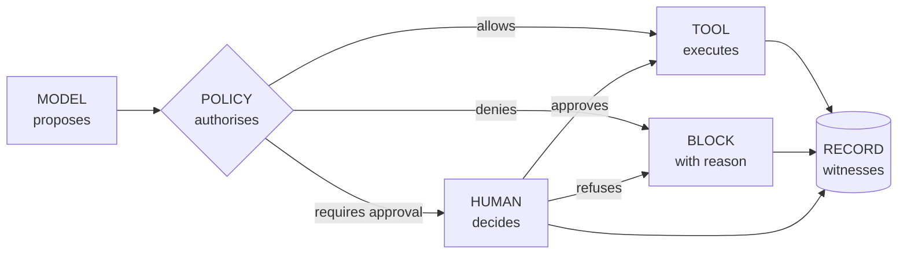

# D1 · The separation of powers

*Working directory, not reader-facing.* The Mermaid sketch is the plain-text plan a diagram is drawn from. Per `STANDARDS.md`, change this file first, then redraw `../part3/d1-separation-of-powers.svg` by hand to match. Labels below are the published ones.

**Purpose.** The central diagram of Part 3, the equivalent of Part 2's matrix of guides and sensors. It has to be understood in five seconds by a board member.

**Where it goes.** Part 3, section 3.

**Rendering note.** Four functions in a row, the human detour above and the block below. The record has to look different from the rest because it is the only one that neither decides nor acts, only witnesses: a cylinder instead of a rectangle.

**Caption.** THE MODEL PROPOSES · THE POLICY AUTHORISES · THE TOOL EXECUTES · THE RECORD WITNESSES. The figure caption adds that Anthropic's own architecture keeps the session as an append-only log outside the harness and outside the sandbox (revision of 5 October 2026).
