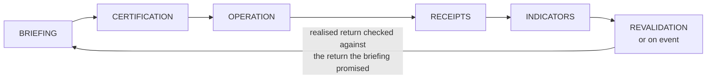

# D10 · The office's quarterly loop

*Working directory, not reader-facing.* The Mermaid sketch is the plain-text plan a diagram is drawn from. Per `STANDARDS.md`, change this file first, then redraw `../part4/d10-quarterly-loop.svg` by hand to match. Labels below are the published ones.

**Purpose.** Show that the office also closes a loop, and that it ends where it began, at the briefing, when the promised return comes back to be checked.

**Where it goes.** Part 4, section 5, closing it; and the opening of the playbook.

**Rendering note.** Risk: it can be confused with MEDIR, which is what D7 exists to avoid. The title states that it runs by quarter, not by task, and the caption says MEDIR runs inside each box, not between them. Revision of 5 October 2026: the REVALIDATION box carries the sub-label "or on event", which the original sketch had and the drawing had lost.

**Caption.** THIS LOOP RUNS BY QUARTER, NOT BY TASK. MEDIR RUNS INSIDE EACH BOX ABOVE, NOT BETWEEN THEM.
