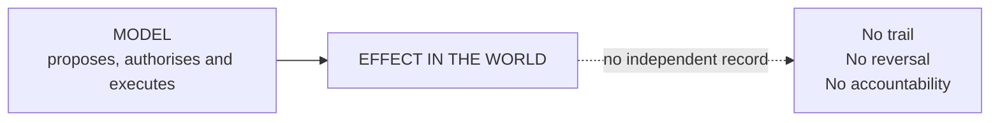

# D2 · The failure mode: concentration

*Working directory, not reader-facing.* The Mermaid sketch is the plain-text plan a diagram is drawn from. Per `STANDARDS.md`, change this file first, then redraw `../part3/d2-concentration.svg` by hand to match. Labels below are the published ones.

**Purpose.** Show, beside D1, what most deployments actually have. The pair side by side is the whole argument.

**Where it goes.** Part 3, section 3, right after D1.

**Rendering note.** It has to look visually poor next to D1: fewer boxes, one dotted arrow, a lot of empty space. The poverty is the argument.

**Caption.** The caption says this is what Air Canada's chatbot ran on.
