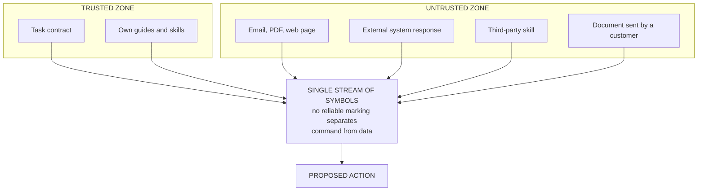

# D3 · Where the order enters inside the data

*Working directory, not reader-facing.* The Mermaid sketch is the plain-text plan a diagram is drawn from. Per `STANDARDS.md`, change this file first, then redraw `../part3/d3-order-inside-the-data.svg` by hand to match. Labels below are the published ones.

**Purpose.** Explain, without jargon, why instruction injection is architecture and not configuration. The hardest diagram to get right and the most valuable in the piece.

**Where it goes.** Part 3, section 5.

**Rendering note.** The two zones stay visually apart until the point of convergence, and the funnel has to be obvious.

**Caption.** THE BOUNDARY EXISTS IN YOUR DIAGRAM, NOT INSIDE THE MODEL.
