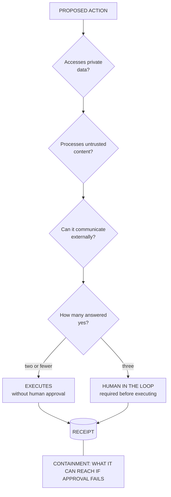

# D4 · The rule of two

*Working directory, not reader-facing.* The Mermaid sketch is the plain-text plan a diagram is drawn from. Per `STANDARDS.md`, change this file first, then redraw `../part3/d4-rule-of-two.svg` by hand to match. Labels below are the published ones.

**Purpose.** The operational tool of Part 3. Three questions, a count, a decision. It has to fit on a committee slide.

**Where it goes.** Part 3, section 3, after D2.

**Rendering note.** Three questions in a column, the count as the single decision point, both outputs converging on the receipt: approved or not, everything is recorded. The containment band below the result is drawn dashed, because it is not a step in the flow but a limit that holds when the flow fails (added 5 October 2026).

**Caption.** APPROVED OR NOT, EVERYTHING IS RECORDED.
