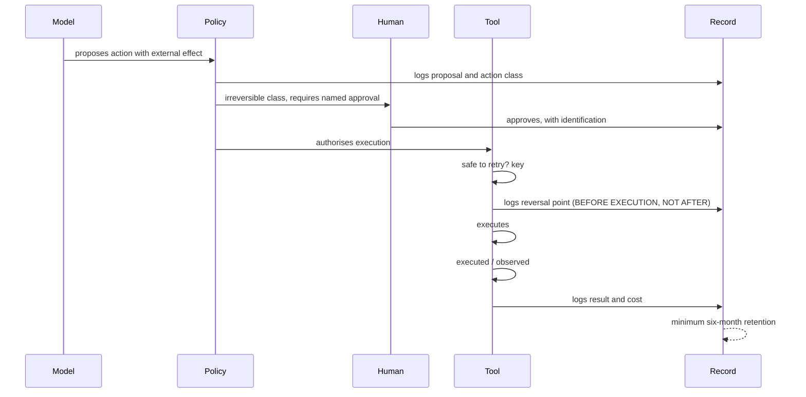

# D5 · The life of an action with an external effect

*Working directory, not reader-facing.* The Mermaid sketch is the plain-text plan a diagram is drawn from. Per `STANDARDS.md`, change this file first, then redraw `../part3/d5-life-of-an-action.svg` by hand to match. Labels below are the published ones.

**Purpose.** Show the separation of powers over time, and where the reversal point and the legal retention sit. The diagram that answers the legal department's question.

**Where it goes.** Part 3, section 6.

**Rendering note.** A sequence diagram with thin vertical lines. The reversal point logged BEFORE execution is what has to jump out (heavier line, boxed, with its own note), because logging it afterwards is the most common mistake. Revision of 5 October 2026: two self-steps on the tool, "safe to retry? key" before the reversal point and "executed / observed" after execution, because an action that is not safe to repeat needs an operation key, and because the record has to say which of the four moments (requested, executed, observed, committed) it reached.

**Caption.** The reversal point is logged before the tool executes, not after.
