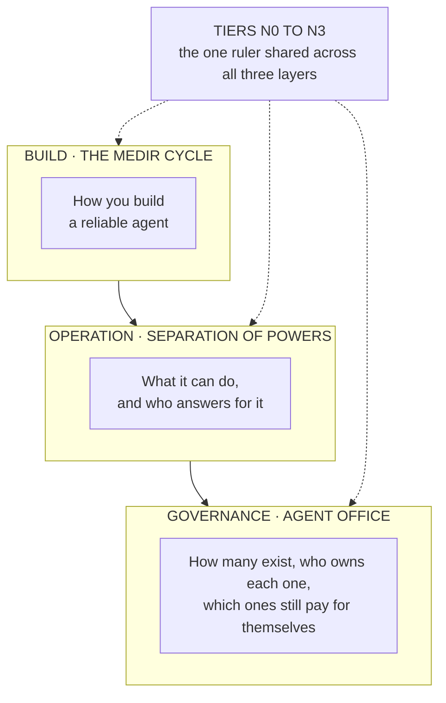

# D6 · The three layers of the framework

*Working directory, not reader-facing.* The Mermaid sketch is the plain-text plan a diagram is drawn from. Per `STANDARDS.md`, change this file first, then redraw `../part4/d6-three-layers.svg` by hand to match. Labels below are the published ones.

**Purpose.** Place the reader in the whole and show there are only three layers, crossed by a single ruler. The closing diagram of the whole series.

**Where it goes.** Part 4, section 1.

**Rendering note.** Three stacked layers and the ruler as a vertical element touching all three. The ruler touching all three is the message: it is the only shared vocabulary, and what keeps the framework from becoming three loose things.

**Caption.** THE ONE RULER SHARED ACROSS ALL THREE LAYERS.
