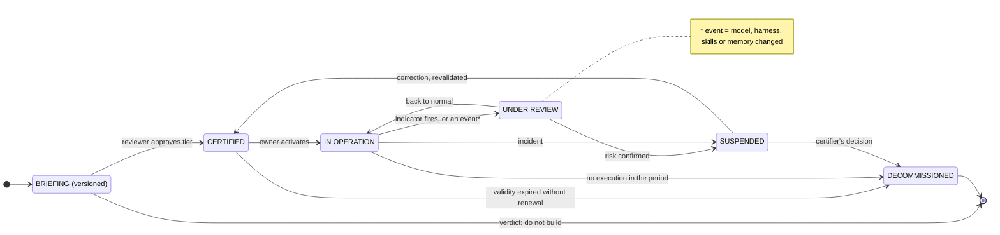

# D7 · The agent life cycle

*Working directory, not reader-facing.* The Mermaid sketch is the plain-text plan a diagram is drawn from. Per `STANDARDS.md`, change this file first, then redraw `../part4/d7-agent-lifecycle.svg` by hand to match. Labels below are the published ones.

**Purpose.** The central contribution of Part 4. It has to make clear this is not MEDIR: MEDIR repeats many times inside a task, this happens once per agent and has states, not steps.

**Where it goes.** Part 4, section 3.

**Rendering note.** Two transitions need visual emphasis, because they are the ones nobody implements: validity expired without renewal, and no execution in the period, both leading to decommissioning (the heavier lines). Revision of 5 October 2026: the "indicator fires" transition also fires on an event, a change of model, harness, skills or memory, with the footnote under the caption.

**Caption.** THE TWO TRANSITIONS NOBODY IMPLEMENTS ARE THE HEAVIER LINES.
