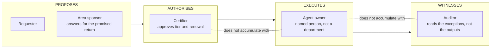

# D8 · The four roles and the non-accumulation rule

*Working directory, not reader-facing.* The Mermaid sketch is the plain-text plan a diagram is drawn from. Per `STANDARDS.md`, change this file first, then redraw `../part4/d8-four-roles.svg` by hand to match. Labels below are the published ones.

**Purpose.** What makes a director adopt the framework: it turns a principle into an organisation chart.

**Where it goes.** Part 4, section 4.

**Rendering note.** The four groups reuse D1's exact verbs, proposes, authorises, executes, witnesses. That deliberate repetition ties Part 3 to Part 4 and shows that the technical and the organisational separation of powers are the same idea on two planes.

**Caption.** THE AUDITOR READS THE EXCEPTIONS THE AGENT CREATED, NOT THE OUTPUTS IT PRODUCED.
