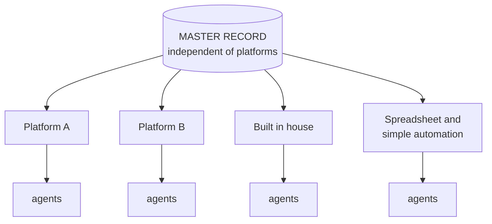

# D9 · Every platform governs inward

*Working directory, not reader-facing.* The Mermaid sketch is the plain-text plan a diagram is drawn from. Per `STANDARDS.md`, change this file first, then redraw `../part4/d9-platforms-govern-inward.svg` by hand to match. Labels below are the published ones.

**Purpose.** Justify why the office has to be a function of the company and not a product it buys. The closing argument of Part 4.

**Where it goes.** Part 4, section 8.

**Rendering note.** The wall of each platform has to be visible, and the master record clearly above and outside every wall. The published diagram does not carry the sketch's original second line under the master record ("checked against the approved use cases"), which the published drawing dropped.

**Caption.** EACH PLATFORM IS DEEP, CREDIBLE AND LIMITED BY ITS OWN WALLS. YOUR RESPONSIBILITY IS NOT.
