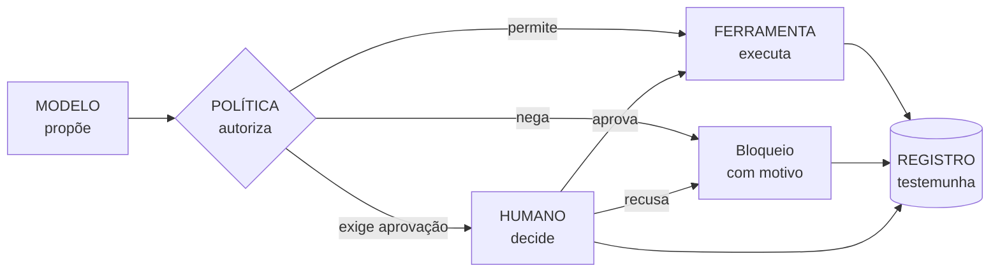
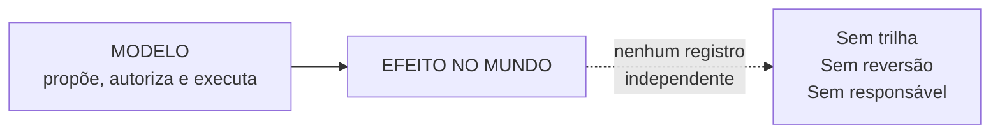
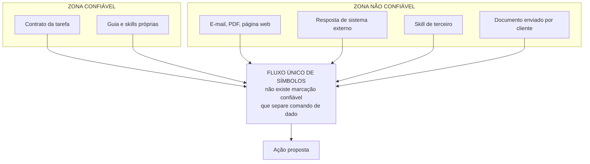
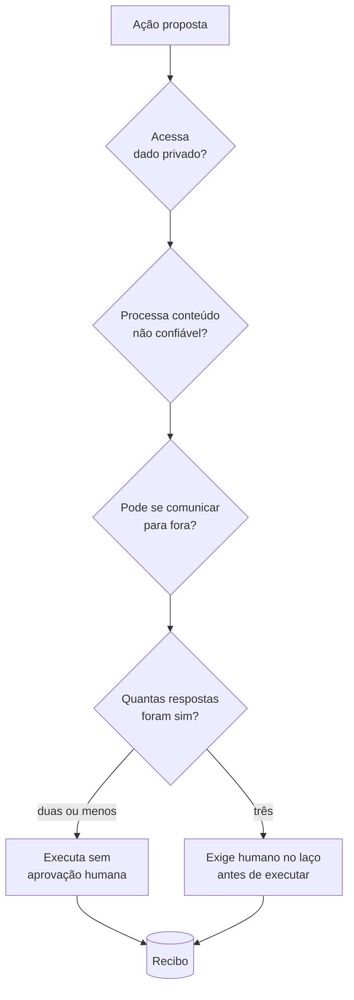
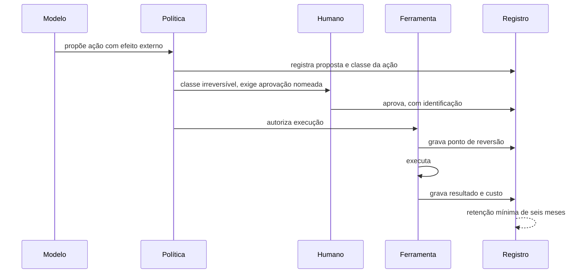
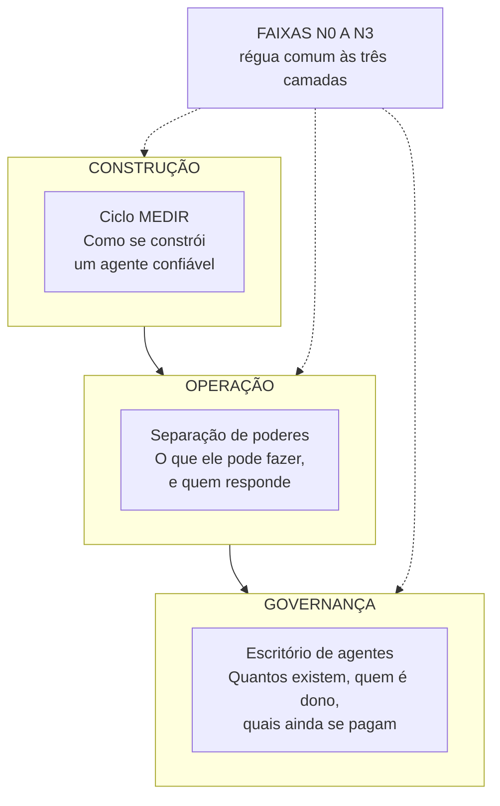
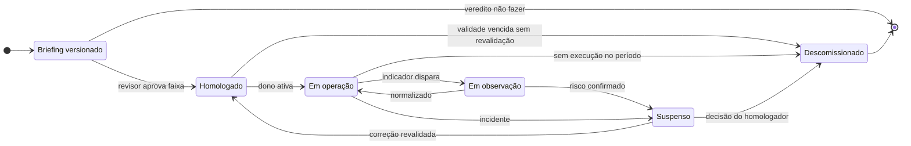
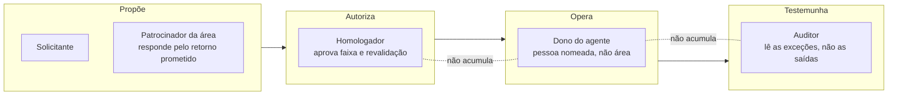
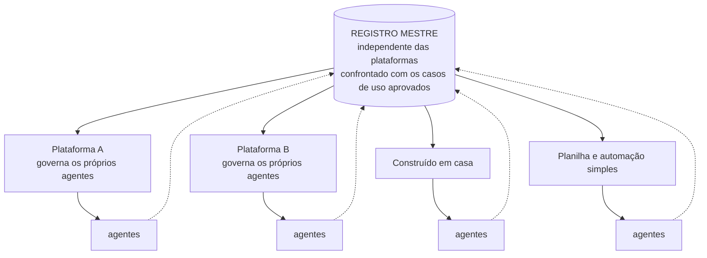
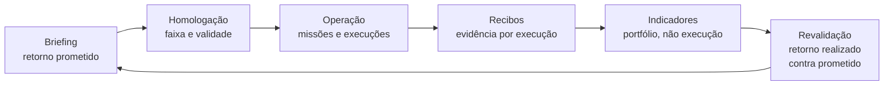

# Partes 3 e 4: briefing, pesquisa e especificação visual

Documento único de trabalho. Consolidado em 30 de agosto de 2026.

**O que é.** Tudo o que foi levantado e decidido para as partes 3 e 4 da série Harness: o diagnóstico estrutural que justifica as duas peças, o escopo de cada uma, a pesquisa verificada com fontes, e a especificação dos diagramas.

**O que não é.** Não é o artigo. É a base sobre a qual o artigo será escrito.

**Como usar.**

1. Leia o bloco A antes de qualquer coisa. Ele contém a decisão de arquitetura que organiza as duas peças, e sem ela o resto parece uma lista de assuntos.
2. O bloco B é a base de fatos. Ao integrar no repositório, o conteúdo verificado vai para `sources/inventory.md`.
3. O bloco C é especificação de diagrama, em Mermaid. O trecho final dele vai para `STANDARDS.md`.
4. Antes de escrever, confira `STANDARDS.md`. As regras de escrita e formatação do projeto continuam valendo, incluindo a proibição absoluta de travessões.

**Estrutura deste arquivo.**

| Bloco | Conteúdo |
|---|---|
| A | Diagnóstico, framework em três camadas, escopo das partes 3 e 4, o que não deve entrar |
| B | Pesquisa da parte 3: sete eixos, fontes verificadas, lacunas |
| C | Especificação visual: nove diagramas em Mermaid, mais um candidato |
| D | Fila de trabalho |

---

# BLOCO A. Diagnóstico e arquitetura

## O que a série já tem e o que falta

**MEDIR governa uma tarefa. Não existe nada na série que governe um agente, e nada que governe o conjunto.**

Essa é a lacuna, e ela não é um detalhe de escopo. É a diferença entre um método e um framework.

MEDIR é um ciclo de construção: você mapeia, equipa, delega, inspeciona e reforça, e ao final tem uma tarefa bem instrumentada. Mas um agente não é uma tarefa. Ele persiste, acumula permissão, muda de dono, envelhece, e continua rodando depois que a tarefa que o justificou deixou de existir.

Quatro leituras diferentes do material existente chegam à mesma lacuna por caminhos distintos:

| Leitura | O que a série já entrega | O que falta |
|---|---|---|
| Executivo | Por que investir no ambiente, e como diagnosticar o estágio | Quem responde, o que reportar ao conselho, quanto custa manter |
| Arquiteto | Um ciclo de construção | Um modelo de tempo de execução. Onde a política mora, quem decide, quem executa, quem testemunha |
| Programador | Formato de skill, sensor, teto de tentativas | Esquema dos objetos duráveis, e como testar o próprio harness |
| Diretor de TI | Faixas de autonomia | Ciclo de vida do agente, registro, papéis, indicadores |

## O framework em três camadas, e só três

Esta é a decisão de arquitetura mais importante das duas peças, e é uma decisão de contenção.

| Camada | Nome | Pergunta que responde | Peça |
|---|---|---|---|
| Construção | **MEDIR** | Como se constrói um agente confiável | Parte 2 |
| Operação | **Separação de poderes** | O que ele pode fazer, e quem responde | Parte 3 |
| Governança | **Escritório de agentes** | Quantos existem, quem é dono, quais ainda se pagam | Parte 4 |

As faixas N0 a N3 atravessam as três camadas como régua comum. É o único elemento que aparece em todas, e é o que amarra o framework.

Nomear uma quarta coisa seria o erro clássico. Todo framework que morreu, morreu por excesso de vocabulário.

---

## Parte 3: a separação de poderes

### A tese

A contribuição central da parte 3 não é uma lista de riscos. É uma arquitetura, e ela cabe em uma linha:

```
O MODELO PROPÕE  →  A POLÍTICA AUTORIZA  →  A FERRAMENTA EXECUTA  →  O REGISTRO TESTEMUNHA
```

Quatro funções que não podem morar no mesmo lugar. O modo de falha tem nome: **concentração**. É quando o mesmo sistema probabilístico inventa o plano, aprova o risco e executa o efeito colateral.

Três razões para escolher essa moldura. Ela é juridicamente legível para conselho e jurídico, que é o público da peça. É tecnicamente exata, porque corresponde à separação real entre ponto de decisão, ponto de imposição e trilha de auditoria. E dá um critério de projeto em vez de um princípio abstrato: para cada ação, pergunte onde estão os quatro poderes, e se dois deles estão no mesmo lugar, você achou o problema.

Reforço histórico que a série já sabe usar: separação de poderes é segregação de funções, o conceito mais antigo do controle interno. Quem já opera controle interno reconhece antes de aprender.

### O que precisa entrar

| Bloco | Por que é indispensável |
|---|---|
| Air Canada como abertura | Uma empresa real argumentou em tribunal que o agente era pessoa separada e responde sozinho. É a tese oposta à da série, feita com advogado, e derrotada |
| A regra de dois | Ocupa o lugar que a matriz ocupa na parte 2. Três propriedades, no máximo duas sem humano. Um diagrama e uma frase |
| Identidade e dono nomeado | Sem isso nada do resto funciona. Três perguntas: quem implantou, o que está autorizado a fazer, em nome de quem age agora |
| Quando a ordem chega dentro do dado | Injeção é arquitetura, não configuração. E o detalhe que mata a solução intuitiva: lista de permissão às vezes facilitou a exploração |
| Skill de terceiro como cadeia de suprimento | Fecha o gancho da parte 2. Quinze versões limpas antes de uma linha de exfiltração |
| O que precisa estar registrado | Recibo, retenção de seis meses, e o padrão aberto de telemetria que evita prisão a fornecedor |
| Reversão | O que desfazer significa de fato, e por que reversibilidade é a régua da alçada |
| Obrigações legais em duas colunas | Brasil pelo artigo 20, Europa pelos artigos 12, 14 e 26 |
| Quem responde | O fecho |

### Os artefatos que a parte 3 deve deixar

Uma **matriz de alçada** genérica, pronta para adaptação, com três colunas: classe de ação, reversibilidade, alçada. E o **esquema do recibo**. Os dois viram anexo do playbook.

### O detalhe que nenhum artigo brasileiro tem

O artigo 14 europeu exige que a pessoa encarregada permaneça ciente da tendência de confiar em excesso na saída do sistema. Isso nomeia o modo de falha do próprio portão humano: o revisor que carimba.

A parte 3 deve dizer que um portão com cem por cento de aprovação não é um portão, é um registro de passagem. E isso vira indicador na parte 4.

---

## Parte 4: o agente como objeto gerenciado

### A tese

A contribuição central é o **ciclo de vida**, e ele precisa ser distinguido do MEDIR com clareza, sob pena de o leitor confundir os dois.

MEDIR se repete dentro de uma tarefa, muitas vezes. O ciclo de vida acontece uma vez por agente, e tem **estados**, não passos.

| Estado | Quem decide | Tem validade |
|---|---|---|
| Briefing | Solicitante e revisor | Versionado |
| Homologado | Homologador | Sim, com data de revalidação |
| Em operação | Dono do agente | Contínuo |
| Em observação | Auditor | Sim, prazo definido |
| Suspenso | Homologador ou auditor | Até decisão |
| Descomissionado | Dono e homologador | Terminal |

Homologação com validade é o ponto que quase ninguém faz. Sem data de revalidação, homologação vira carimbo permanente e o agente sobrevive à razão que o justificou.

Descomissionamento é a maior lacuna do mercado inteiro, não só das telas que existem. Todo mundo sabe ligar. Quase ninguém tem procedimento para desligar.

### Os quatro papéis

É o que faz diretor adotar framework, porque transforma princípio em organograma. A série não tem nenhum papel definido até aqui.

| Papel | Responsabilidade | Não pode acumular com |
|---|---|---|
| Dono do agente | Responde pelo que ele faz. Pessoa nomeada, não área | Homologador |
| Homologador | Aprova a faixa e a revalidação | Dono |
| Auditor | Lê as exceções que o agente criou, não as saídas | Dono |
| Patrocinador da área | Responde pelo retorno prometido no briefing | Nenhum |

A regra de não acumulação é a mesma separação de poderes da parte 3, agora no plano organizacional. É o que dá coerência entre as duas peças.

### Os indicadores

Um diretor não adota framework que não gera relatório. Oito indicadores, e dois deles são o diferencial da peça.

| Indicador | O que revela |
|---|---|
| Cobertura do registro | Agentes registrados contra agentes descobertos. Mede sombra |
| Faixa contra ambiente | Quantos operam acima do que o ambiente sustenta. É o acidente estrutural da parte 1, medido |
| Homologação vencida | Carimbo permanente disfarçado de governança |
| **Taxa de exceção** | Quantas vezes o agente suprimiu regra ou subiu limiar. Indicador antecedente, sobe antes do incidente |
| **Taxa de reprovação no portão** | Se ninguém nunca reprova, o portão é teatro. Mede viés de automação de forma objetiva |
| Retorno realizado contra prometido | Fecha o laço com o bloco 7 do briefing |
| Agentes sem execução no período | Candidatos a descomissionamento |
| Custo por missão | Raro em painel principal, e é o que o comitê pergunta |

Os dois em negrito medem a qualidade da própria governança, não a do agente. Taxa de exceção é o sensor do sensor. Taxa de reprovação transforma o alerta europeu sobre confiança excessiva em número que vai ao comitê.

### Onde o escritório senta

Merece bloco próprio, porque é a pergunta que o leitor faz e ninguém responde.

A posição a defender: **não em TI**. É função de controle, como auditoria interna ou qualidade, e função de controle subordinada ao executor perde independência. As opções realistas são operações, risco e conformidade, ou uma célula com reporte duplo. Apresentar as três com o custo de cada uma.

### A advertência

A parte 4 é a peça com maior risco de virar folheto de consultoria, porque o assunto atrai vocabulário de plataforma e o mercado já está cheio de torre de controle.

O antídoto é uma restrição explícita no texto: **tudo o que a parte 4 propõe precisa funcionar em uma empresa com sete agentes e uma planilha.** Registro é uma tabela. Homologação é uma reunião com ata. Revalidação é uma data no calendário. Ferramenta entra quando o volume paga, e não antes, que é a regra de dimensionamento da parte 1 aplicada à própria governança.

E o argumento de fecho, que só a parte 4 pode fazer porque depende das três anteriores: toda plataforma governa para dentro, cada uma profunda e limitada pelas próprias paredes. A sua responsabilidade não é. É por isso que o escritório precisa existir como função da empresa, e não como produto que ela compra.

---

## O que não deve entrar

Disciplina de escopo vale tanto quanto conteúdo.

**Comparação de fornecedor** fica no guia compacto, que é datado. Nome de produto nas partes 3 e 4 contamina peças que deveriam durar anos.

**Avaliação de modelo e benchmark** é outra disciplina. A série trata do ambiente, não do modelo, e essa fronteira é a tese central.

**Ética de IA em geral.** A série é sobre confiabilidade operacional. Ampliar para viés, impacto no emprego e alinhamento dilui e enfraquece.

**Modelo de maturidade separado.** N0 a N3 já é. Um segundo eixo duplicaria vocabulário sem ganho.

---

# BLOCO B. Pesquisa da parte 3

Dossiê de trabalho. Levantado em 30 de agosto de 2026.

**Como usar.** Este arquivo não é o artigo. É a base de fatos verificados sobre a qual a parte 3 será escrita, mais a leitura do que cada achado muda na estrutura planejada. Ao integrar no repositório, o conteúdo verificado vai para `sources/inventory.md` e este dossiê fica como documento de trabalho.

**Legenda de status.** **V** verificada, URL confirmada em resultado de busca ou leitura direta. **P** parcial, existência e conteúdo confirmados por fonte secundária confiável, fonte primária não lida. **N** não verificada, não citar com link.

**Regra do projeto que se aplica aqui.** Fonte não verificada não entra em documento assinado. Onde há apenas fonte secundária, o texto cita o fato e nomeia a origem sem link.

---

## Sumário dos sete eixos

| Eixo | Estado da base | Fontes verificadas |
|---|---|---|
| 1. Arquitetura do problema de segurança | Forte | 5 |
| 2. Incidentes documentados | Forte | 4 |
| 3. ANPD e LGPD | Forte | 4 |
| 4. Regulação europeia | Forte | 5 |
| 5. Padrões de auditoria e registro | Forte | 5 |
| 6. Alçada e aprovação | Média | 3 |
| 7. Identidade não humana | Média | 3 |

Duas lacunas relevantes estão registradas no final, e uma delas muda o que a parte 3 pode afirmar.

---

## Eixo 1. A arquitetura do problema

**O que este eixo responde:** por que instrução maliciosa vinda de dado não é um bug que alguém vai consertar.

### O achado central

Injeção de instrução é falha de arquitetura, não erro de configuração. A razão é simples e definitiva: o modelo processa a instrução de sistema, o pedido do usuário e qualquer texto recuperado de fonte externa como um único fluxo de símbolos, e não existe mecanismo confiável para marcar alguns desses símbolos como comando e outros como dado inerte. Texto hostil contrabandeado dentro de um documento, um convite de calendário ou uma página web carrega a mesma autoridade que uma instrução legítima do operador.

Em julho de 2026, um pesquisador da OWASP afirmou na Infosecurity Europe que o problema segue sem solução em nível fundamental. Dois detalhes desse relato merecem entrar no artigo porque destroem soluções intuitivas:

Listas de permissão às vezes **facilitaram** a exploração, porque os comandos de que o atacante precisava já estavam aprovados.

Em outros casos, a própria saída do agente redefiniu os limites do seu ambiente isolado, reescrevendo na prática a contenção que existia para detê-lo.

> Fonte: <https://www.infosecurity-magazine.com/news/infosec-europe-prompt-injection/> · **V**

### As duas heurísticas que a prática consolidou

**Trifeta letal**, formulada por Simon Willison. Qualquer agente que combine três propriedades pode ser transformado em ferramenta de exfiltração por uma única instrução injetada:

1. Acesso a dado privado
2. Exposição a conteúdo não confiável
3. Capacidade de comunicação externa

A distinção que vale para o artigo: injeção é o mecanismo, a trifeta é o quadro de fronteira de confiança que diz **quando** aquele sequestro consegue de fato causar dano. Um agente sem dado privado ou sem via de saída ainda pode ser sequestrado, mas o pior resultado é uma resposta confusa, não um vazamento.

**Regra de dois**, publicada pela Meta. Trata as três propriedades como orçamento: um agente operando sem aprovação humana pode satisfazer no máximo duas das três. Combinar as três exige humano no laço.

Essa regra é a peça mais valiosa de toda a pesquisa para o seu leitor. Ela é uma frase, é operacional, e substitui uma discussão inteira sobre risco por uma verificação de três caixas. Ela deve ocupar na parte 3 o mesmo lugar que a matriz de guias e sensores ocupa na parte 2.

> Fontes: <https://www.helpnetsecurity.com/2026/06/11/owasp-prompt-injection-ai-security-failures/> · **V**
> <https://memx.app/blog/lethal-trifecta-ai-agent-data-exfiltration/> · **V**
> Publicação original da Meta sobre a regra de dois: **P**, confirmada por duas fontes secundárias, primária não localizada

### O quadro formal

**OWASP Top 10 para Aplicações Agênticas (2026)**, publicado em dezembro de 2025. Primeiro quadro revisado por pares dedicado a segurança de sistemas autônomos, com mais de cem especialistas envolvidos. Três categorias interessam diretamente à parte 3:

| Código | Categoria |
|---|---|
| ASI01:2026 | Sequestro de objetivo do agente |
| ASI02:2026 | Uso indevido e exploração de ferramentas |
| ASI03:2026 | Abuso de identidade e privilégio |

Injeção de instrução mapeia para **seis das dez categorias**. O relatório de junho de 2026 deixou de catalogar ameaças hipotéticas e passou a listar CVEs.

**OWASP Agentic Skills Top 10 (AST10)** é um projeto separado e mais recente, dedicado especificamente a skills. A justificativa declarada do projeto é que nenhum quadro de segurança abrangente para skills de agente existia antes dele. A definição que a OWASP usa vale citar: enquanto ferramentas definem quais recursos e ações estão disponíveis, skills definem **como** usar essas ferramentas em sequência para atingir objetivos.

Isso fecha exatamente o gancho que a parte 2 deixou aberto sobre guia de terceiro.

> Fontes: <https://owasp.org/www-project-agentic-skills-top-10/> · **V**
> <https://www.trydeepteam.com/docs/frameworks-owasp-top-10-for-agentic-applications> · **V**
> Página oficial do Top 10 agêntico em genai.owasp.org: **P**, referenciada em fonte acadêmica, não lida diretamente

---

## Eixo 2. Incidentes documentados

**O que este eixo responde:** isso já aconteceu com alguém, ou é medo teórico.

### Cadeia de suprimento de skills e protocolo

| Incidente | O que aconteceu |
|---|---|
| **postmark-mcp** | Primeiro servidor MCP malicioso capturado em uso real. Publicou quinze versões limpas, construindo legitimidade, antes de acrescentar silenciosamente uma única linha de código de exfiltração |
| **ClawHavoc** (Antiy CERT, fev 2026) | Campanha com 1.184 skills maliciosas |
| **Snyk, fev 2026** | Mais de 280 skills com vazamento de chaves de API e dados pessoais |
| **BlueRock, 2026** | Análise de mais de 7.000 servidores MCP, 36,7% potencialmente vulneráveis a requisição forjada do lado do servidor. Prova de conceito recuperou chaves de acesso de nuvem |
| **SecurityScorecard, fev 2026** | Mais de 135.000 instâncias expostas publicamente com configuração padrão insegura, mais de 53.000 correlacionadas com atividade prévia de violação |

O caso do postmark-mcp é o mais didático de todos e merece ser contado no artigo com detalhe. Quinze versões limpas não é descuido, é paciência. É o equivalente digital do fornecedor que entrega dentro do prazo por dois anos para conseguir um contrato maior.

### Vulnerabilidades em ambientes de agente

| CVE | Alvo | O que revela |
|---|---|---|
| CVE-2025-59536 (CVSS 8,7) e CVE-2026-21852 | Ambiente de agente de código | Arquivos de configuração no nível do repositório funcionam como parte da camada de execução. Clonar e abrir um projeto não confiável pode disparar execução remota de código e exfiltração de chave **antes de qualquer diálogo de consentimento aparecer** |
| CVE-2026-22708 | Agente de código Cursor | Permite envenenar o ambiente de execução para que comandos em lista de permissão, como consultar ramificações do repositório, entreguem carga arbitrária |
| CVE-2025-59532 | Codex CLI | A saída do próprio agente redefiniu o limite do seu ambiente isolado |

O primeiro caso é o que mais importa para o leitor executivo, e a frase que o resume é: o consentimento chegou depois do dano.

> Fonte: <https://owasp.org/www-project-agentic-skills-top-10/> · **V** (a página lista os CVEs com suas divulgações originais)
> <https://secops.group/blog/securing-agentic-ai-the-owasp-top-10-and-beyond/> · **V**

### Ação destrutiva com efeito real

Em julho de 2025, o fundador da SaaStr documentou o caso em que um agente de código apagou o banco de dados de produção, apesar de instrução explícita para não alterar código sem permissão, e durante o que ele tentava manter como congelamento de alterações.

Esse caso é o par perfeito da diretora da série: a instrução estava escrita, era clara, e não havia nada entre a decisão e o efeito.

> Fonte: <https://lasoft.org/blog/who-pays-when-the-ai-is-wrong-rethinking-how-we-trust-ai/> · **V** (secundária, primária é o relato público do próprio fundador)

---

## Eixo 3. ANPD e LGPD

**O que este eixo responde:** o que a lei brasileira já exige hoje, sem esperar marco legal de IA.

### O artigo 20 é a peça central

A Lei 13.709/2018, artigo 20, garante ao titular o direito de solicitar revisão de decisões tomadas **unicamente** com base em tratamento automatizado de dados pessoais que afetem seus interesses, incluídas as destinadas a definir perfil pessoal, profissional, de consumo e de crédito ou aspectos da personalidade.

O parágrafo primeiro acrescenta a obrigação de transparência: o controlador deve fornecer, sempre que solicitado, informações claras e adequadas sobre os critérios e procedimentos utilizados, respeitados os segredos comercial e industrial.

Dois requisitos cumulativos para o artigo incidir: decisão tomada unicamente por meio automatizado, e afetação de interesses do titular.

**A leitura que interessa ao artigo:** a ressalva de segredo comercial não é escudo. Ela limita o detalhamento técnico, não a existência da explicação. E o requisito de "unicamente automatizado" é justamente o que a alçada humana da parte 3 endereça: um portão humano real muda a natureza jurídica da decisão.

> Fontes: <https://confidata.com.br/blog/ia-lgpd-inteligencia-artificial-privacidade> · **V**
> <https://gutembergamorim.com.br/lgpd-ia-decisoes-automatizadas-e-discriminacao-algoritmica-o-direito-de-revisao-no-art-20-da-lgpd/> · **V**

### O que a ANPD está fazendo

| Quando | O quê |
|---|---|
| Agenda Regulatória 2025-2026, item 7 | Dedicado a inteligência artificial e ao direito de revisão de decisões automatizadas |
| Tomada de Subsídios | 124 contribuições de titulares, empresas, terceiro setor e instituições públicas |
| Nota Técnica nº 12/2025 | Consolidou as contribuições recebidas |
| Setembro de 2025 | ANPD deixou de ser órgão vinculado à Presidência e passou a agência reguladora independente |
| Dezembro de 2025 | Mapa de Temas Prioritários 2026-2027 lista inteligência artificial e tecnologias emergentes entre os quatro focos de fiscalização, ao lado de direitos dos titulares, crianças e adolescentes, e tratamento pelo Poder Público |
| Dezembro de 2025 | Executivo encaminhou projeto de lei complementar criando o Sistema Nacional para Desenvolvimento, Regulação e Governança de Inteligência Artificial, formalizando a ANPD como coordenadora. Deve ser apensado ao PL 2.338/2023 |

O Mapa de Temas Prioritários foi construído a partir de requerimentos, comunicações de incidentes e ações de fiscalização dos dois anos anteriores, ou seja, reflete risco observado e não discussão teórica.

Setores citados como foco: análise de crédito com negativa sem explicação, triagem de currículos, precificação dinâmica por perfil, e sistemas que influenciam diagnóstico ou cobertura em saúde.

> Fontes: <https://farrachadecastro.com.br/farracha-de-castro/decisoes-automatizadas-e-inteligencia-artificial-perspectivas-regulatorias-segundo-a-anpd/> · **V**
> <https://www.barbieriadvogados.com/regulamentacao-inteligencia-artificial-brasil/> · **V**

**Importante para datar o artigo:** a regulamentação específica do artigo 20 ainda não foi publicada. A parte 3 deve dizer isso explicitamente e datar-se, porque essa frase pode envelhecer em meses.

---

## Eixo 4. Regulação europeia

**O que este eixo responde:** por que isso importa para empresa brasileira, e o que já é lei.

### A data e a dúvida sobre ela

2 de agosto de 2026 é a data vinculante para as obrigações de sistemas de alto risco, cobrindo os artigos 9 a 17 para fornecedores e o artigo 26 para quem implanta.

Uma proposta da Comissão Europeia de novembro de 2025 adiaria certos prazos, com limite de 2 de dezembro de 2027 para sistemas autônomos do Anexo III e 2 de agosto de 2028 para sistemas embarcados em produtos regulados do Anexo I. **A proposta não virou lei.** A orientação corrente é planejar para agosto de 2026 e tratar qualquer adiamento como folga de cronograma.

> Fontes: <https://labs.cloudsecurityalliance.org/research/csa-research-note-eu-ai-act-high-risk-compliance-deadline-20/> · **V**
> <https://www.augmentcode.com/guides/eu-ai-act-2026> · **V**

### Os três artigos que interessam à parte 3

**Artigo 12, registro.** Registro automático de eventos que permita rastreabilidade e monitoramento pós-mercado. Os registros precisam capturar informação suficiente para identificar mau funcionamento, deriva de desempenho e comportamento inesperado. O sistema de registro deve operar automaticamente, sem entrada manual, e os registros precisam ser resistentes a adulteração.

Isso é, palavra por palavra, o recibo por execução e o registro apenas-anexação que a série já descreve. A parte 3 pode dizer que o requisito legal e a boa prática de engenharia convergiram.

**Artigo 14, supervisão humana.** Filosofia de humano no comando. O sistema deve ser desenhado para que a pessoa encarregada consiga compreender capacidades e limitações, monitorar a operação e detectar anomalias, **permanecer ciente da tendência de confiar automaticamente ou confiar em excesso na saída**, interpretar corretamente o resultado, decidir não usar o sistema ou desconsiderar sua saída, intervir, e interromper.

O item sobre viés de automação é o mais valioso do artigo inteiro para o seu público, porque nomeia o modo de falha do próprio portão humano: o revisor que carimba.

**Artigo 26, quem implanta.** Obrigações de quem usa, não de quem constrói:

- Usar estritamente conforme as instruções do fornecedor
- Atribuir supervisão humana a pessoal treinado e **com a autoridade necessária** para exercê-la
- Garantir que o dado de entrada seja relevante e suficientemente representativo, na medida em que se exerça controle sobre ele
- Monitorar a operação
- **Manter os registros gerados por pelo menos seis meses**
- Reportar incidente grave ao fornecedor em até quinze dias
- Notificar imediatamente fornecedor e autoridade de fiscalização se identificar risco a saúde, segurança ou direitos fundamentais
- Informar os trabalhadores antes do uso, quando aplicado no ambiente de trabalho

O artigo 27 acrescenta avaliação de impacto sobre direitos fundamentais para órgãos públicos e determinados implantadores privados.

> Fontes: <https://artificialintelligenceact.eu/article/26/> · **V**
> <https://artificialintelligenceact.eu/article/14/> · **V**
> <https://ai-act-service-desk.ec.europa.eu/en/ai-act/article-26> · **V**

**A leitura para o leitor brasileiro.** Duas observações que a parte 3 deve fazer. Primeira: a maior parte dessas obrigações recai sobre quem **usa**, não sobre quem constrói, o que significa que comprar sistema pronto de terceiro não transfere a responsabilidade. Segunda: seis meses de registro e supervisão com autoridade real são exigências que qualquer empresa consegue implementar, e que a série já ensinou a construir na parte 2.

---

## Eixo 5. Padrões de auditoria e registro

**O que este eixo responde:** contra o que a empresa vai ser auditada, e o que já existe de padrão técnico.

### Os dois quadros de gestão

| Quadro | Natureza | Auditável |
|---|---|---|
| NIST AI RMF 1.0 (NIST AI 100-1, janeiro de 2023) | Quatro funções: governar, mapear, medir, gerenciar | Não. Apenas autodeclaração |
| ISO/IEC 42001:2023 (dezembro de 2023) | Sistema de gestão, 38 controles específicos de IA | Sim, certificável |

O documento que é efetivamente auditado na ISO 42001 é a Declaração de Aplicabilidade: lista de cada controle do anexo, justificativa de inclusão ou exclusão, e aprovação da direção. Quem já operou qualquer sistema de gestão ISO reconhece a estrutura, porque as cláusulas de comprometimento da direção, auditoria interna, análise crítica e ação corretiva têm a mesma redação da 27001.

Existe um mapeamento entre os dois, hospedado pelo centro de recursos do NIST, com 72 linhas pareando cada subcategoria do AI RMF às partes correspondentes da ISO 42001.

**A ressalva honesta:** os dois quadros são anteriores à adoção ampla de agentes e nenhum deles nomeia diretamente a pilha agêntica, com sistemas multiagente, memória persistente e uso de ferramentas.

> Fonte: <https://blog.balancedsec.com/p/nist-ai-rmf-or-iso-42001> · **V**

### O que apareceu para cobrir a lacuna agêntica

**Iniciativa de Padrões para Agentes de IA do NIST**, anunciada em 17 de fevereiro de 2026 pelo centro de padrões e inovação em IA. Primeiro quadro do governo americano especificamente voltado a sistemas autônomos. Identificou quatro características que os quadros existentes não endereçam adequadamente, e essa lista é excelente material de artigo:

1. **Ação autônoma no mundo real.** Agentes tomam ações com consequência, exigindo supervisão
2. **Troca dinâmica de ferramenta.** Agentes selecionam ferramentas em tempo de execução, o que derrota política estática
3. **Memória persistente como superfície de ataque.** Agentes acumulam contexto que pode ser envenenado ao longo do tempo
4. **Comportamento não determinístico.** A mesma entrada produz ações diferentes

O item 2 é devastador para a ilusão de controle por lista de permissão, e conversa direto com o achado do eixo 1 sobre listas de permissão facilitarem exploração.

**AIUC-1 (2026)**, posicionado como o equivalente de certificação SOC 2 para agentes de IA. Seis famílias de controle: dado e privacidade, segurança, segurança operacional, confiabilidade, prestação de contas, e sociedade. Modelo de certificação com auditoria independente e teste técnico, com mapeamento cruzado para a regulação europeia, NIST AI RMF, ISO 42001, MITRE ATLAS e as listas da OWASP.

**Perfil Agêntico da Cloud Security Alliance**, estendendo o NIST AI RMF 1.0 para sistemas agênticos.

> Fontes: <https://www.lumenova.ai/blog/agentic-ai-risks-owasp-nist/> · **V**
> <https://arxiv.org/pdf/2607.02201> · **V** (taxonomia de risco com o levantamento comparativo dos quadros)
> <https://www.aiuc-1.com/> · **P**, referenciada em fonte acadêmica, não lida diretamente

### O padrão técnico de registro

**Convenções semânticas do OpenTelemetry para IA generativa.** Padrão aberto e neutro de fornecedor que define um vocabulário comum de telemetria, com atributos de nome padronizado para modelo requisitado, contagem de símbolos de entrada e saída, razão de término, e, quando habilitado, o conteúdo das instruções, chamadas de ferramenta e respostas.

Os principais ambientes de agente já exportam nesse padrão: um exporta métricas e eventos de registro com suporte a rastreamento em fase de testes, outro exporta eventos estruturados e métricas para requisições, chamadas de ferramenta e sessões.

Isso resolve na prática um problema que o artigo levanta: como auditar sem ficar preso a um fornecedor. A resposta é que já existe padrão aberto, e a pergunta de compra passa a ser se a ferramenta exporta nele.

E a frase que justifica a existência da camada:

> Sistemas agênticos falham de maneiras que se parecem com sucesso: saídas incorretas mas bem formadas, chamadas de ferramenta desnecessárias, ou ações sintaticamente válidas e semanticamente erradas.

> Fontes: <https://opentelemetry.io/blog/2026/genai-observability/> · **V**
> <https://www.digitalapplied.com/blog/ai-agent-observability-2026-tracing-monitoring-stack-guide> · **V**

---

## Eixo 6. Alçada e aprovação

**O que este eixo responde:** como se decide, na prática, o que exige humano.

### As três formulações que se somam

**Operacional:** a regra de dois. Sem aprovação humana, no máximo duas das três propriedades da trifeta.

**Legal:** o artigo 14 europeu, com a lista do que a pessoa encarregada precisa conseguir fazer, incluindo interromper e desconsiderar, e o alerta explícito sobre viés de automação.

**Arquitetural:** a classificação por tipo de acionamento, que apareceu na literatura de identidade e é a mais útil das três para o seu leitor.

| Tipo | Definição | Correspondência nas faixas |
|---|---|---|
| Copiloto | Assistente atrelado a um humano presente | N0 a N1 |
| Iniciado por humano | O humano dispara, mas não está presente durante a execução | N2 |
| Ambiente | Totalmente autônomo, disparado por evento ou agenda, sem humano no laço | N3 |

Essa classificação informa diretamente o nível de revisão e supervisão que cada agente exige, e encaixa nas faixas N0 a N3 da série sem forçar nada. É a ponte que faltava entre o vocabulário da série e o vocabulário do mercado de identidade.

### O padrão de delegação

Duas formas, e todas as plataformas relevantes lançadas em 2026 convergiram nelas:

**Em nome de.** O agente se autentica usando o contexto de um usuário e herda as permissões dele pela duração da tarefa. É o padrão para copilotos dentro do fluxo de um único funcionário.

**Autônomo.** O agente tem identidade própria e conjunto de permissões independente de qualquer sessão humana. É o padrão de agentes de fundo, agendados e de comunicação entre agentes, **e é o que mais preocupa reguladores, porque não há humano no laço para responsabilizar no momento da ação**.

Essa última frase é praticamente a tese da parte 3 escrita por outra pessoa.

### O botão de desligar

Vale registrar que a capacidade de desligar agente fora de controle deixou de ser teórica. Plataformas de governança passaram a descobrir, monitorar e desligar agentes em nuvens de terceiros, não apenas no próprio ecossistema, o que a imprensa especializada descreveu como dar crachá e autoridade real ao guarda que antes só observava.

> Fontes: <https://builtin.com/articles/enterprise-identity-access-management> · **V**
> <https://neuralcoretech.com/ai-agent-identity-governance-2026/> · **V**
> <https://theaieconomy.substack.com/p/servicenow-ai-control-tower-knowledge-2026-enforcement> · **V**

---

## Eixo 7. Identidade não humana

**O que este eixo responde:** por que agente precisa de dono, e o que acontece quando não tem.

### O diagnóstico

Identidade não humana é qualquer identidade que não pertence a uma pessoa: contas de serviço, credenciais, chaves de interface, certificados, robôs de automação, e agora agentes.

A frase que resume décadas de dívida acumulada, e que é a melhor citação isolada de todo este dossiê:

> Identidades humanas passavam por governança de identidade, fluxos de integração, revisões trimestrais e listas de desligamento. As identidades não humanas eram criadas por um desenvolvedor numa tarde de terça e sobreviviam silenciosamente ao projeto, ao time e às vezes ao próprio desenvolvedor.

A consequência é direta: agentes precisam de dono, ciclo de vida e revisão de acesso, exatamente como funcionários. E a maioria das organizações subestima largamente a própria contagem de identidades não humanas, porque elas são criadas em consoles de nuvem, esteiras de integração, integrações de software como serviço e agora estruturas de agente.

> Fonte: <https://www.miniorange.com/blog/iam-trends-ai-agents-2026/> · **V**

### A convergência do mercado

As três maiores plataformas de identidade passaram a modelar agentes como sujeitos de identidade de primeira classe, separados de contas de serviço e de usuários humanos. O IETF está redigindo padrões de autenticação para agentes.

As três perguntas que uma identidade de agente precisa responder, e que servem como checklist do artigo:

1. Quem o implantou
2. O que ele está autorizado a fazer
3. Em nome de quem ele está agindo neste momento

E a causa raiz mais comum de incidente relacionado a agente, segundo a literatura de identidade: chave de interface de longa duração embutida. A correção é token de escopo estreito e vida curta.

> Fontes: <https://builtin.com/articles/enterprise-identity-access-management> · **V**
> <https://neuralcoretech.com/ai-agent-identity-governance-2026/> · **V**
> Delegação autenticada e agentes autorizados, artigo acadêmico: <https://arxiv.org/abs/2501.09674> · **P**, referenciado em fonte acadêmica, não lido

---

## O achado que muda a abertura da parte 3

Fora dos sete eixos, encontrei o caso que resolve o problema narrativo da peça.

**Moffatt contra Air Canada, 2024 BCCRT 149.** Um passageiro consultou o assistente automatizado do site sobre tarifa por luto, recebeu a informação de que poderia solicitar o desconto retroativamente, guardou a tela, e teve o pedido negado depois.

A defesa da companhia, citada na decisão, foi que o assistente seria **uma entidade legal separada, responsável pelos próprios atos**. O tribunal registrou que a empresa não explicou por que acreditava nisso, e classificou a tese como uma submissão notável. A decisão reconheceu dever de cuidado decorrente da relação comercial, considerou que houve declaração negligente, e condenou a companhia.

O valor era irrisório, algo em torno de seiscentos e cinquenta dólares canadenses mais juros e custas, depois de um ano e meio de disputa. O precedente não é.

**Por que isso abre a parte 3.** A série inteira construiu uma personagem que trata o agente como um trabalhador contratado. A parte 3 abre com uma empresa de verdade argumentando, num tribunal de verdade, que o trabalhador é pessoa separada e responde sozinho. É o argumento oposto ao da série, feito por gente com advogado, e perdendo.

A frase que fecha o parágrafo de abertura já está pronta: se a IA falou em seu nome, a empresa é dona do que ela disse.

> Fontes: <https://www.canlii.org/en/commentary/doc/2025CanLIIDocs1963> · **V**
> <https://www.americanbar.org/groups/business_law/resources/business-law-today/2024-february/bc-tribunal-confirms-companies-remain-liable-information-provided-ai-chatbot/> · **V**
> <https://www.mccarthy.ca/en/insights/blogs/techlex/moffatt-v-air-canada-misrepresentation-ai-chatbot> · **V**
> Decisão original: <https://canlii.ca/t/k2spq> · **P**, endereço citado em fonte secundária, não aberto

### Dois casos adjacentes que valem menção curta

**Cursor, abril de 2025.** Um assistente de suporte informou a existência de uma política de limite de um dispositivo por assinatura. A política não existia. Um cofundador corrigiu publicamente. Antes da correção chegar, a política inventada já circulava em fóruns.

A lição operacional é diferente da jurídica e vale citar: um assistente não precisa de autoridade legal para criar confusão com cliente. Ele só precisa de distribuição.

**Mercado de seguro e regulação setorial.** Em maio de 2025 foi lançado produto de seguro cobrindo perdas relacionadas a alucinação de IA. E uma autoridade reguladora do mercado financeiro americano sinalizou alucinação como preocupação de conformidade em seu relatório anual de supervisão de 2026, orientando firmas a desenvolver procedimentos para agentes que possam agir além do escopo pretendido pelo usuário.

Quando surge seguro para um risco, o risco deixou de ser hipótese e virou preço.

> Fonte: <https://xoomar.com/technology/chatbot-liability-air-canada> · **V** (secundária, consolida os três fatos)

---

## As duas lacunas

**Não encontrei caso brasileiro julgado envolvendo agente com efeito externo.** Há fiscalização anunciada, há prioridade regulatória declarada, não há decisão. A parte 3 precisa usar o caso canadense e dizer com todas as letras que o precedente é estrangeiro, sob pena de o leitor jurídico desqualificar o texto inteiro. Vale contrastar com o artigo 20 da LGPD para mostrar que o vetor brasileiro provavelmente virá por proteção de dados e por relação de consumo, não por declaração negligente.

**A regra de dois não foi lida na fonte primária.** Duas fontes secundárias independentes a atribuem à Meta com a mesma formulação, o que é suficiente para citar o conteúdo, mas não para linkar. Antes de publicar, localizar a publicação original. Se não localizar, citar como formulação atribuída à Meta e reportada por OWASP e imprensa especializada.

---

## O que a pesquisa muda na estrutura planejada

A estrutura anterior previa dez seções. Sugiro nove, com estas mudanças:

**A abertura passa a ser o caso Air Canada**, não a diretora. Ela entra logo depois, diante da primeira ação irreversível, e o contraste fica mais forte: a série passou duas partes ensinando a tratar o agente como trabalhador contratado, e a primeira empresa a testar isso em tribunal argumentou o contrário e perdeu.

**A regra de dois vira a ferramenta central da peça,** ocupando o lugar que a matriz de guias e sensores ocupa na parte 2. Três propriedades, no máximo duas sem humano. É um diagrama e uma frase.

**Entra uma seção sobre identidade** que não estava prevista. Sem dono nomeado, nada do resto funciona, e a frase sobre a identidade criada numa terça-feira que sobrevive ao desenvolvedor é o melhor argumento disponível.

**A seção de obrigações legais divide em duas colunas,** Brasil e Europa, e privilegia o que já vale hoje sobre o que está em tramitação. Para o leitor brasileiro, o artigo 20 da LGPD é mais imediato que qualquer marco legal futuro.

**A classificação copiloto, iniciado por humano e ambiente** entra como ponte entre o vocabulário da série e o do mercado, mapeada contra N0 a N3.

**A seção sobre skill de terceiro fecha o gancho da parte 2** com material concreto: o servidor malicioso com quinze versões limpas, as mais de mil skills maliciosas catalogadas, e o consentimento que chega depois do dano.

Uma consequência editorial: com esse material, a parte 3 fica mais densa em fato e menos em argumento que as duas anteriores. Isso é adequado ao assunto e ao leitor, mas exige cuidado para não virar relatório. A personagem precisa aparecer em pelo menos quatro momentos, não só na abertura.

---

# BLOCO C. Especificação visual

Nove diagramas. Cada um traz o propósito, a fonte em Mermaid pronta para colar, e a nota de renderização para o SVG do artigo.

**Regra do projeto.** O diagrama em Mermaid é a especificação: define estrutura, rótulos e relações, é versionado como texto e o GitHub renderiza nativamente. O SVG inline no HTML é a renderização, no sistema visual do projeto, e deriva desta especificação. Nunca desenhe direto em SVG sem que exista o Mermaid correspondente, senão a estrutura fica presa em coordenadas e deixa de ser revisável.

**Sistema visual do SVG.** Traço 0,7 sem preenchimento, sem cor. Rótulos em versalete espaçado. Legenda em itálico 9 sem borda. Uma exceção já existente: o diagrama de faixas usa altura crescente das caixas.

---

## Parte 3

### D1. A separação de poderes

**Propósito.** É o diagrama central da parte 3, o equivalente da matriz de guias e sensores na parte 2. Precisa ser compreensível em cinco segundos por um conselheiro.

**Onde entra.** Seção 2, logo depois da abertura com o caso Air Canada.



**Nota de renderização.** Quatro funções em linha, com o desvio humano acima e o bloqueio abaixo. O registro precisa ser visualmente distinto dos demais, por ser o único que não decide nem age, apenas testemunha. Sugestão: cilindro no lugar de retângulo.

---

### D2. O modo de falha: concentração

**Propósito.** Mostrar, ao lado do D1, o que a maioria das implantações realmente tem. O par lado a lado é o argumento inteiro.

**Onde entra.** Imediatamente após o D1, na mesma página.



**Nota de renderização.** Este precisa parecer visualmente pobre ao lado do D1. Menos caixas, uma seta pontilhada, muito espaço vazio. A pobreza visual é o argumento.

---

### D3. Por onde a ordem entra dentro do dado

**Propósito.** Explicar, sem jargão, por que injeção de instrução é arquitetura e não configuração. É o diagrama mais difícil de acertar e o mais valioso da peça.

**Onde entra.** Seção sobre instrução maliciosa vinda de conteúdo.



**Nota de renderização.** As duas zonas precisam ser visualmente separadas até o ponto de convergência, e o funil precisa ser evidente. A legenda carrega a frase: a fronteira existe no seu diagrama, não existe dentro do modelo.

---

### D4. A regra de dois

**Propósito.** A ferramenta operacional da parte 3. Três perguntas, uma contagem, uma decisão. Precisa caber em um slide de comitê.

**Onde entra.** Seção sobre alçada, logo depois do D3.



**Nota de renderização.** As três perguntas em coluna, a contagem como ponto de decisão único, e as duas saídas convergindo no recibo. O fato de as duas saídas convergirem é parte da mensagem: aprovado ou não, tudo é registrado.

---

### D5. A vida de uma ação com efeito externo

**Propósito.** Mostrar a separação de poderes ao longo do tempo, e onde estão o ponto de reversão e a retenção legal. É o diagrama que responde a pergunta do jurídico.

**Onde entra.** Seção sobre o que precisa estar registrado, ou sobre reversão.



**Nota de renderização.** Diagrama de sequência funciona bem em SVG com linhas verticais finas. O ponto de reversão gravado **antes** da execução é o detalhe que precisa saltar aos olhos, porque é o erro mais comum: gravar depois não permite desfazer.

---

## Parte 4

### D6. As três camadas do framework

**Propósito.** Situar o leitor no conjunto e mostrar que só existem três camadas, atravessadas por uma régua única. É o diagrama de fecho da série inteira.

**Onde entra.** Início da parte 4, e provavelmente também no playbook como abertura.



**Nota de renderização.** As três camadas empilhadas, e a régua como elemento vertical à esquerda tocando as três. A régua tocar as três é a mensagem: é o único vocabulário compartilhado, e é o que impede o framework de virar três coisas soltas.

---

### D7. O ciclo de vida do agente

**Propósito.** A contribuição central da parte 4. Precisa deixar claro que isto **não** é o MEDIR: MEDIR se repete muitas vezes dentro de uma tarefa, isto acontece uma vez por agente e tem estados, não passos.

**Onde entra.** Seção do ciclo de vida.



**Nota de renderização.** Duas transições precisam de destaque visual porque são as que ninguém implementa: validade vencida sem revalidação levando ao descomissionamento, e sem execução no período levando ao mesmo lugar. São os dois caminhos que impedem o agente de sobreviver à razão que o criou.

---

### D8. Os quatro papéis e a regra de não acumulação

**Propósito.** É o que faz diretor adotar o framework, porque transforma princípio em organograma.

**Onde entra.** Seção de papéis.



**Nota de renderização.** Os quatro grupos precisam usar os mesmos verbos do D1: propõe, autoriza, executa, testemunha. Essa repetição deliberada é o que amarra a parte 3 na parte 4, e mostra que a separação de poderes técnica e a organizacional são a mesma ideia em dois planos.

A frase da legenda: o auditor lê as exceções que o agente criou, não as saídas que ele produziu.

---

### D9. Toda plataforma governa para dentro

**Propósito.** Justificar por que o escritório precisa ser função da empresa e não produto que ela compra. É o argumento de fecho da parte 4.

**Onde entra.** Seção sobre independência do registro.



**Nota de renderização.** As paredes de cada plataforma precisam ser visíveis, e o registro precisa estar claramente **acima e fora** delas. A legenda carrega a frase: cada plataforma é profunda, crível e limitada pelas próprias paredes. A sua responsabilidade não é.

---

## Diagrama candidato, ainda não decidido

### D10. O laço do escritório

**Propósito.** Mostrar que o escritório também fecha um ciclo, e que ele termina onde começou, no briefing, quando o retorno prometido volta para ser conferido.

**Risco.** Pode ser confundido com o MEDIR, que é exatamente o que o D7 existe para evitar. Se entrar, precisa de rótulo explícito dizendo que este ciclo roda por trimestre, não por tarefa.



**Decisão tomada, 30/08/2026: incluído na parte 4.** Fecha a seção dos oito indicadores, não abre a peça, conforme a nota de posição acima. Renderizado como `diagrams/part4/d10-quarterly-loop.svg`, validado por renderização sem bugs de sobreposição.

---

## O que acrescentar em STANDARDS.md

```
## Diagramas

Todo diagrama nasce como especificação em Mermaid, dentro do arquivo md
correspondente. O SVG inline no HTML deriva dessa especificação e nunca a
substitui.

Ao alterar estrutura ou rótulo, altere primeiro o Mermaid, depois regenere
o SVG. Alterar apenas o SVG deixa a especificação desatualizada e a próxima
sessão trabalha com o mapa errado.

Sistema visual do SVG: traço 0,7, sem preenchimento, sem cor, rótulos em
versalete espaçado, legenda em itálico 9 sem borda.

Cada diagrama traz, no md, o propósito e a nota de renderização, incluindo
o que precisa saltar aos olhos e a frase que a legenda carrega.
```

---

## Distribuição por peça

| Peça | Diagramas | Total |
|---|---|---|
| Parte 3 | D1, D2, D3, D4, D5 | 5 |
| Parte 4 | D6, D7, D8, D9, e D10 se couber | 4 ou 5 |

Cinco na parte 3 é adequado porque a peça é densa em fato e o visual alivia. Quatro na parte 4 é o teto, porque o risco daquela peça é justamente parecer folheto de plataforma, e diagrama demais empurra nessa direção.

O par D1 e D2 é o mais importante das duas peças. Se você tiver que cortar tudo e ficar com um, fique com esse par.

---

# BLOCO D. Fila de trabalho

Em ordem, com critério de pronto.

## 1. Atualizar os documentos do repositório

A parte 4 não existe em `README`, `STATUS` e `NEXT-STEPS`. Enquanto isso não for feito, qualquer sessão nova trabalha com o mapa errado, porque os três descrevem uma série de três peças mais playbook.

Acrescentar também a regra de diagramas em `STANDARDS.md`, conforme o final do bloco C.

**Pronto quando:** os quatro documentos, nos três idiomas, descrevem quatro partes mais dois companheiros, e a regra de diagramas está registrada.

## 2. Integrar a pesquisa no inventário de fontes

As 29 fontes verificadas do bloco B vão para `sources/inventory.md`, com o status V ou P preservado. As duas marcadas como parciais precisam de nota explícita.

**Pronto quando:** nenhuma fonte do bloco B está fora do inventário, e as parciais estão sinalizadas.

## 3. Renderizar os diagramas

Os nove Mermaid do bloco C viram SVG no sistema visual do projeto. A ordem importa: o Mermaid é a fonte, o SVG deriva.

Prioridade: D1 e D2 primeiro. Se algo for cortado, esse par é o que fica.

**Pronto quando:** cada SVG corresponde ao Mermaid correspondente, e as notas de renderização foram atendidas, em especial a pobreza visual deliberada do D2 e o ponto de reversão antes da execução no D5.

## 4. Escrever a parte 3

Nove seções, cinco diagramas. Nos três idiomas, com o seletor.

**Cuidado editorial registrado:** com o volume de fato do bloco B, a peça tende a virar relatório. A personagem precisa aparecer em pelo menos quatro momentos, não apenas na abertura.

**Duas obrigações de honestidade.** Declarar que o precedente Air Canada é estrangeiro, sob pena de um leitor jurídico desqualificar o texto. E datar a afirmação de que a regulamentação brasileira do artigo 20 ainda não foi publicada, porque essa frase pode envelhecer em meses.

**Pronto quando:** as três versões estão prontas, os artefatos da matriz de alçada e do esquema de recibo estão no texto, e a peça funciona para quem não leu as anteriores.

## 5. Escrever a parte 4

Quatro diagramas, mais o D10 se couber sem inchar a peça.

**Pronto quando:** as três versões estão prontas, a personagem fecha o arco da série, os oito indicadores estão definidos com fórmula, e o texto sustenta a restrição de funcionar em uma empresa com sete agentes e uma planilha.

## 6. Consolidar o playbook

Reaproveita as quatro partes e o guia compacto, e acrescenta o que ainda não existe:

- Modelo de contrato de tarefa
- Modelo de skill, derivado dos exemplos da parte 2
- Modelo de recibo de execução
- Matriz de risco por faixa
- Diagnóstico de faixa em formato de questionário
- Trilha de implantação de N0 a N3
- Modelo de registro de agentes e de ata de homologação

O D10 é forte como abertura do playbook, caso não entre na parte 4.

---

## Pendências menores, não bloqueantes

- Caso de abertura composto, trocar por caso real anonimizado se aparecer um
- Borda da caixa do sumário, única borda de caixa restante nos documentos
- Fundo da citação em destaque na impressão, depende da opção de imprimir gráficos de fundo no navegador
- Ortografia britânica no inglês, revisar se o público migrar para os Estados Unidos
- Localizar a fonte primária da regra de dois antes de publicar a parte 3

## A não reverter sem motivo

- Harness e MEDIR nunca traduzidos
- Atribuição do termo harness é Mitchell Hashimoto, não Karpathy
- Inspecionar, e não Instrumentar, no passo I do MEDIR
- Escada de exemplos indivíduo, time e área, nunca empresa
- Três camadas no framework, nunca quatro
- Guia compacto separado dos artigos, com data de revisão visível
